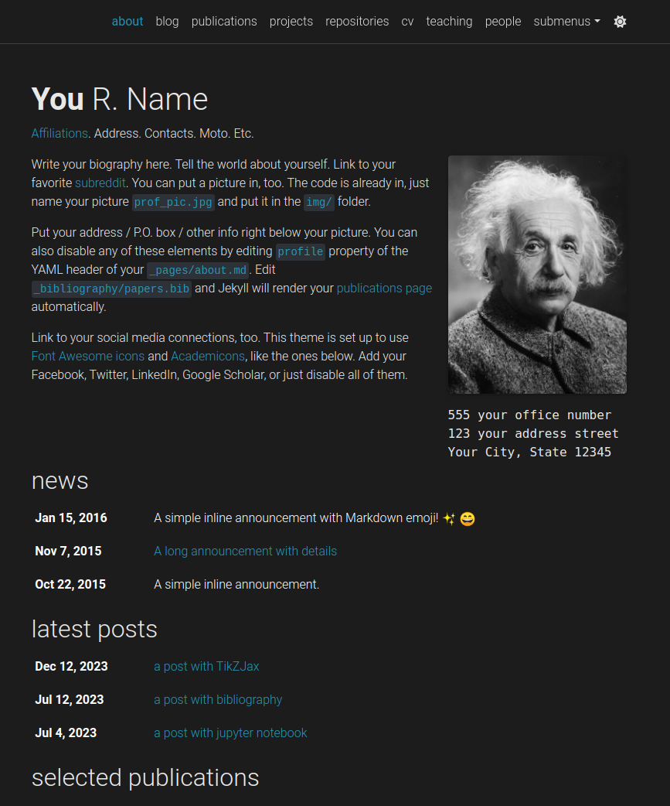
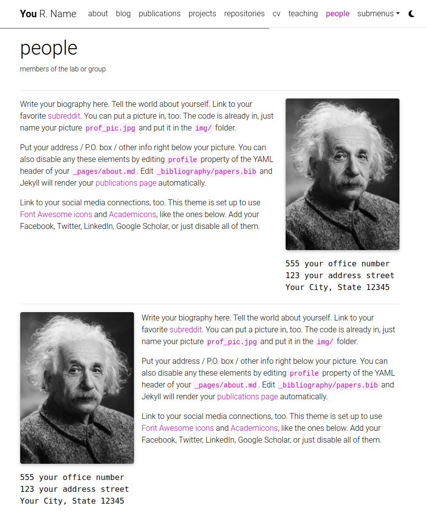
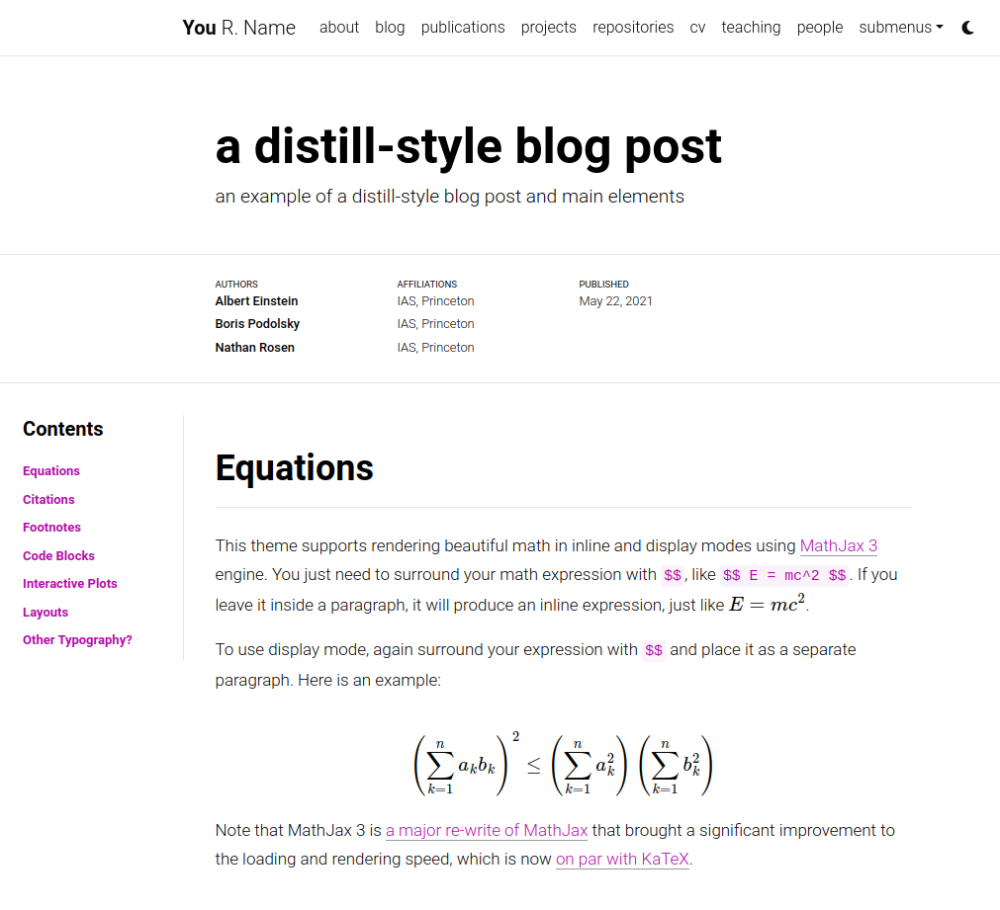

<!-- ### Personal webpage of [Mujgan Huseynli](https://mujganhuseynli.github.io) -->

<h1 align="center">Hi there 👋, I'm Mujgan Huseynli</h1>
<!-- <h3 align="center">I'm a final-year Electrical Engineering master's student at GWU with a passion for Robotics, Control Systems, and Power Systems, currently working at Honeywell while preparing to pursue a PhD.</h3> -->

<p align="center"> 
 
<a href="https://linkedin.com/in/mujganhuseynli"></a>
<a href="mailto:huseynli.muzhgan@gmail.com"></a>
<a href="https://mujganhuseynli.github.io"></a>
</p>

<!-- [](https://www.linkedin.com/in/jlim/) -->

I am a final-year Electrical Engineering master’s student at [George Washington University (GWU)](https://www.gwu.edu/) 🇺🇸. I earned my bachelor's degree in Electrical Engineering from [Baku Higher Oil School (BHOS)](https://bhos.edu.az) 🇦🇿, and I also spent a semester at [Alcalá University](https://www.uah.es/en/) 🇪🇸.

I love solving complex challenges in Robotics, Control Systems, and Power Systems, particularly through the application of cutting-edge technologies such as Artificial Intelligence, Machine Learning, and IoT to enhance innovation and efficiency.

Currently, I work as a Project Engineer I at [Honeywell](https://honeywell.com) 🇺🇸, where I explore new paradigms and apply advanced computational techniques to enhance the capabilities of smart and autonomous systems.

Previously, I interned as an Instrumentation and Control Engineer at [Emerson](https://emerson.com) 🇺🇸 and [Socar Polymer](https://www.socarpolymer.az/) 🇦🇿, where I developed and implemented control strategies for industrial processes.

***I am actively seeking to advance my career by pursuing a PhD in Electrical Engineering and am eager to collaborate with leading scholars in these vibrant fields.***

<!-- <p align="left"> <a href="https://twitter.com/" target="blank"></a> </p> -->

<!-- - 😄 Pronouns: She/Her -->
<p align="center"><a href="https://github.com/ryo-ma/github-profile-trophy"></a></p>

- 🔭 Currently working on my thesis - ["Design and Analysis of a FPGA-based Controller for GAN-based Three-Phase Inverters: Efficiency, Performance, and Reliability Optimization"](https://github.com/mujganhuseynli/thesis.git)

- 👨‍💻 All of the past projects are available at [my repositories.](https://github.com/mujganhuseynli?tab=repositories)

<!-- <p>&nbsp;</p> -->

- 📝 Regularly writing articles on [my blog.](https://mujganhuseynli.github.io)

- 📫 [Email me.](mailto:huseynli.muzhgan@gmail.com)

- 📄 [Know about my experiences.](https://mujganhuseynli.github.io/resume.pdf)
- <a href="https://www.linkedin.com/in/your-profile"></a> [Connect with me on LinkedIn](https://linkedin.com/in/mujganhuseynli)
<!-- <h3 align="left">Connect with me:</h3>
<p align="left">
<a href="https://linkedin.com/in/mujganhuseynli" target="blank"></a>
</p> -->
**Programming skills:**


<a href="https://www.mathworks.com/" target="_blank" rel="noreferrer"> </a>

**Frameworks and Libraries:**


<!-- **Specialized Software:**

<a href="https://www.autodesk.com/products/autocad" target="_blank"></a>
<a href="https://www.autodesk.com/products/autocad" target="_blank"></a> -->
**Tools:**


**Languages:**
### 🇬🇧 🇩🇪 🇷🇺 🇹🇷 🇦🇿
<!-- <p></p>  -->
<!-- <h3 align="left">Languages and Tools:</h3>
<p align="left"> <a href="https://www.arduino.cc/" target="_blank" rel="noreferrer">  </a> <a href="https://aws.amazon.com" target="_blank" rel="noreferrer">  </a> <a href="https://azure.microsoft.com/en-in/" target="_blank" rel="noreferrer">  </a> <a href="https://www.cprogramming.com/" target="_blank" rel="noreferrer">  </a> <a href="https://www.w3schools.com/cpp/" target="_blank" rel="noreferrer">  </a> <a href="https://www.w3schools.com/css/" target="_blank" rel="noreferrer">  </a> <a href="https://www.docker.com/" target="_blank" rel="noreferrer">  </a> <a href="https://www.figma.com/" target="_blank" rel="noreferrer">  </a> <a href="https://flask.palletsprojects.com/" target="_blank" rel="noreferrer">  </a> <a href="https://cloud.google.com" target="_blank" rel="noreferrer">  </a> <a href="https://git-scm.com/" target="_blank" rel="noreferrer">  </a> <a href="https://www.w3.org/html/" target="_blank" rel="noreferrer">  </a> <a href="https://gohugo.io/" target="_blank" rel="noreferrer">  </a> <a href="https://www.adobe.com/in/products/illustrator.html" target="_blank" rel="noreferrer">  </a> <a href="https://developer.mozilla.org/en-US/docs/Web/JavaScript" target="_blank" rel="noreferrer">  </a> <a href="https://www.linux.org/" target="_blank" rel="noreferrer">  </a> <a href="https://www.mathworks.com/" target="_blank" rel="noreferrer">  </a> <a href="https://www.mysql.com/" target="_blank" rel="noreferrer">  </a> <a href="https://opencv.org/" target="_blank" rel="noreferrer">  </a> <a href="https://www.photoshop.com/en" target="_blank" rel="noreferrer">  </a> <a href="https://www.postgresql.org" target="_blank" rel="noreferrer">  </a> <a href="https://www.python.org" target="_blank" rel="noreferrer">  </a> <a href="https://pytorch.org/" target="_blank" rel="noreferrer">  </a> <a href="https://scikit-learn.org/" target="_blank" rel="noreferrer">  </a> <a href="https://www.tensorflow.org" target="_blank" rel="noreferrer">  </a> <a href="https://www.adobe.com/products/xd.html" target="_blank" rel="noreferrer">  </a> </p>

<!-- <p></p>

<p>&nbsp;</p> -->

<!-- <p align="left"> <a href="https://github.com/ryo-ma/github-profile-trophy"></a> </p> -->

<!--
**mujganhuseynli/mujganhuseynli** is a ✨ _special_ ✨ repository because its `README.md` (this file) appears on your GitHub profile.

Here are some ideas to get you started:

- 🔭 I’m currently working on ...
- 🌱 I’m currently learning ...
- 👯 I’m looking to collaborate on ...
- 🤔 I’m looking for help with ...
- 💬 Ask me about ...
- 📫 How to reach me: ...
- 😄 Pronouns: ...
- ⚡ Fun fact: ...
-->


<!-- # al-folio

<div align="center">

[](https://alshedivat.github.io/al-folio/)

**A simple, clean, and responsive [Jekyll](https://jekyllrb.com/) theme for academics.**

---

[](https://github.com/alshedivat/al-folio/actions/workflows/deploy.yml)
[](#maintainers)
[](https://github.com/alshedivat/al-folio/graphs/contributors/)
[](https://hub.docker.com/r/amirpourmand/al-folio)
[](https://hub.docker.com/r/amirpourmand/al-folio)
[](https://hub.docker.com/r/amirpourmand/al-folio)

[](https://github.com/alshedivat/al-folio/releases/latest)
[](https://github.com/alshedivat/al-folio/blob/master/LICENSE)
[](https://github.com/alshedivat/al-folio)
[](https://github.com/alshedivat/al-folio/fork)

</div>

## User community

The vibrant community of **al-folio** users is growing!
Academics around the world use this theme for their homepages, blogs, lab pages, as well as webpages for courses, workshops, conferences, meetups, and more.
Check out the community webpages below.
Feel free to add your own page(s) by sending a PR.

<table>
<tr>
<td>Academics</td>
<td>
<a href="https://martinbulla.github.io" target="_blank">★</a>
<a href="https://maruan.alshedivat.com" target="_blank">★</a>
<a href="https://www.cs.columbia.edu/~chen1ru/" target="_blank">★</a>
<a href="https://maithraraghu.com" target="_blank">★</a>
<a href="https://platanios.org" target="_blank">★</a>
<a href="https://otiliastr.github.io" target="_blank">★</a>
<a href="https://www.maths.dur.ac.uk/~sxwc62/" target="_blank">★</a>
<a href="https://jessachandler.com/" target="_blank">★</a>
<a href="https://mayankm96.github.io/" target="_blank">★</a>
<a href="https://markdean.info/" target="_blank">★</a>
<a href="https://kakodkar.github.io/" target="_blank">★</a>
<a href="https://sahirbhatnagar.com/" target="_blank">★</a>
<a href="https://spd.gr/" target="_blank">★</a>
<a href="https://jay-sarkar.github.io/" target="_blank">★</a>
<a href="https://aborowska.github.io/" target="_blank">★</a>
<a href="https://aditisgh.github.io/" target="_blank">★</a>
<a href="https://alexhaydock.co.uk/" target="_blank">★</a>
<a href="https://alixkeener.net/" target="_blank">★</a>
<a href="https://andreea7b.github.io/" target="_blank">★</a>
<a href="https://rishabhjoshi.github.io/" target="_blank">★</a>
<a href="https://sheelabhadra.github.io/" target="_blank">★</a>
<a href="https://giograno.me/" target="_blank">★</a>
<a href="https://immsrini.github.io/" target="_blank">★</a>
<a href="https://apooladian.github.io/" target="_blank">★</a>
<a href="https://chinmoy-dutta.github.io/" target="_blank">★</a>
<a href="https://liamcli.com/" target="_blank">★</a>
<a href="https://yoonholee.com/" target="_blank">★</a>
<a href="https://zrqiao.github.io/" target="_blank">★</a>
<a href="https://abstractgeek.github.io/" target="_blank">★</a>
<a href="https://www.compphys.de/" target="_blank">★</a>
<a href="https://julianstreyczek.github.io" target="_blank">★</a>
<a href="https://sdaza.com" target="_blank">★</a>
<a href="https://niweera.gq" target="_blank">★</a>
<a href="https://www.alihkw.com" target="_blank">★</a>
<a href="https://amirpourmand.ir" target="_blank">★</a>
<a href="https://scottleechua.github.io" target="_blank">★</a>
<a href="https://sk1y101.github.io" target="_blank">★</a>
<a href="https://yyang768osu.github.io" target="_blank">★</a>
<a href="https://veedata.github.io" target="_blank">★</a>
<a href="https://K-Wu.github.io" target="_blank">★</a>
<a href="https://amalawilson.com" target="_blank">★</a>
<a href="https://tirtharajdash.github.io" target="_blank">★</a>
<a href="https://carolinacarreira.github.io" target="_blank">★</a>
<a href="https://manandey.github.io" target="_blank">★</a>
<a href="https://johanneshoerner.github.io" target="_blank">★</a>
<a href="https://ioannismavromatis.com" target="_blank">★</a>
<a href="https://taidnguyen.github.io" target="_blank">★</a>
<a href="https://lbugnon.github.io" target="_blank">★</a>
<a href="https://joahannes.github.io" target="_blank">★</a>
<a href="https://dominikstrb.github.io" target="_blank">★</a>
<a href="https://tylerbarna.com" target="_blank">★</a>
<a href="https://daviddmc.github.io/" target="_blank">★</a>
<a href="https://andreaskuster.ch/" target="_blank">★</a>
<a href="https://ellisbrown.github.io/" target="_blank">★</a>
<a href="https://noman-bashir.github.io/" target="_blank">★</a>
<a href="https://djherron.github.io/" target="_blank">★</a>
<a href="https://rodosingh.github.io/" target="_blank">★</a>
<a href="https://vdivakar.github.io/" target="_blank">★</a>
<a href="https://george-gca.github.io/" target="_blank">★</a>
<a href="https://bashirkazimi.github.io/" target="_blank">★</a>
<a href="https://dohaison.github.io/" target="_blank">★</a>
<a href="https://raphaaal.github.io/" target="_blank">★</a>
<a href="https://varuniyer.info/" target="_blank">★</a>
<a href="https://yukimasano.github.io/" target="_blank">★</a>
<a href="https://hashe037.github.io/" target="_blank">★</a>
<a href="https://wang-boyu.github.io/" target="_blank">★</a>
<a href="https://qingqingchen.info" target="_blank">★</a>
<a href="https://bajinsheng.github.io/" target="_blank">★</a>
<a href="https://www.silviofanzon.com/" target="_blank">★</a>
<a href="https://kaikaiyao.github.io/" target="_blank">★</a>
<a href="https://alchemz.github.io/" target="_blank">★</a>
<a href="https://samadamday.com/" target="_blank">★</a>
<a href="https://fanpu.io/" target="_blank">★</a>
<a href="https://abigalekim.github.io/" target="_blank">★</a>
<a href="https://lucasresck.github.io/" target="_blank">★</a>
<a href="https://users.wpi.edu/~lfichera/" target="_blank">★</a>
<a href="https://anmspro.github.io/" target="_blank">★</a>
<a href="https://berlyne.net/" target="_blank">★</a>
<a href="https://filippomazzoli.github.io/" target="_blank">★</a>
<a href="https://www.escontrela.me/" target="_blank">★</a>
<a href="https://raffaem.github.io/" target="_blank">★</a>
<a href="https://cbueth.de/" target="_blank">★</a>
<a href="https://kyleaoman.github.io/" target="_blank">★</a>
<a href="https://decwest.github.io/" target="_blank">★</a>
<a href="https://www.jedburkat.com" target="_blank">★</a>
<a href="https://hrzhang.me" target="_blank">★</a>
<a href="https://kudhru.github.io/" target="_blank">★</a>
<a href="https://mbarbetti.github.io/" target="_blank">★</a>
<a href="https://www.zhivotenko.com/" target="_blank">★</a>
<a href="https://giordanodaloisio.github.io/" target="_blank">★</a>
<a href="https://aadityaura.github.io/" target="_blank">★</a>
<a href="https://abhinav-mehta.github.io/" target="_blank">★</a>
<a href="https://shubhashisroydipta.com/" target="_blank">★</a>
<a href="https://astanziola.github.io" target="_blank">★</a>
<a href="https://tinkerer.in" target="_blank">★</a>
<a href="https://sam-bieberich.github.io/" target="_blank">★</a>
<a href="https://afraniomelo.github.io/en/" target="_blank">★</a>
<a href="https://jonaruthardt.github.io" target="_blank">★</a>
<a href="https://www.zla.app/" target="_blank">★</a>
<a href="https://stavros.github.io" target="_blank">★</a>
<a href="https://ericslyman.com" target="_blank">★</a>
<a href="https://ztjona.github.io/" target="_blank">★</a>
<a href="https://chrischoi314.github.io" target="_blank">★</a>
<a href="https://riccobelli.faculty.polimi.it" target="_blank">★</a>
<a href="https://kishanved.tech/" target="_blank">★</a>
<a href="https://abhilesh.github.io/" target="_blank">★</a>
<a href="https://jackjburnett.github.io/" target="_blank">★</a>
<a href="https://physics-morris.github.io/" target="_blank">★</a>
<a href="https://sraf.ir" target="_blank">★</a>
<a href="https://acad.garywei.dev/" target="_blank">★</a>
<a href="https://tonideleo.github.io/" target="_blank">★</a>
<a href="https://alonkellner.com/" target="_blank">★</a>
<a href="http://berylbir.github.io/" target="_blank">★</a>
</td>
</tr>
<tr>
<td>Labs</td>
<td>
<a href="https://www.haylab.caltech.edu/" target="_blank">★</a>
<a href="https://sjkimlab.github.io/" target="_blank">★</a>
<a href="https://systemconsultantgroup.github.io/scg-folio/" target="_blank">★</a>
<a href="https://decisionlab.ucsf.edu/" target="_blank">★</a>
<a href="https://programming-group.com/" target="_blank">★</a>
<a href="https://sailing-lab.github.io/" target="_blank">★</a>
<a href="https://inbt.jhu.edu/epidiagnostics/" target="_blank">★</a>
<a href="https://www.nuesl.org/" target="_blank">★</a>
<a href="https://big-culture.github.io/" target="_blank">★</a>
</td>
</tr>
<tr>
<td>Courses</td>
<td>
CMU PGM (<a href="https://sailinglab.github.io/pgm-spring-2019/" target="_blank">S-19</a>) <br>
CMU DeepRL (<a href="https://cmudeeprl.github.io/403_website/" target="_blank">S-21</a>, <a href="https://cmudeeprl.github.io/703website_f21/" target="_blank">F-21</a>, <a href="https://cmudeeprl.github.io/403website_s22/" target="_blank">S-22</a>, <a href="https://cmudeeprl.github.io/703website_f22/" target="_blank">F-22</a>, <a href="https://cmudeeprl.github.io/403website_s23/" target="_blank">S-23</a>, <a href="https://cmudeeprl.github.io/703website_f23/" target="_blank">F-23</a>) <br>
CMU MMML (<a href="https://cmu-multicomp-lab.github.io/mmml-course/fall2020/" target="_blank">F-20</a>, <a href="https://cmu-multicomp-lab.github.io/mmml-course/fall2022/" target="_blank">F-22</a>) <br>
CMU AMMML (<a href="https://cmu-multicomp-lab.github.io/adv-mmml-course/spring2022/" target="_blank">S-22</a>, <a href="https://cmu-multicomp-lab.github.io/adv-mmml-course/spring2023/" target="_blank">S-23</a>) <br>
CMU ASI (<a href="https://cmu-multicomp-lab.github.io/asi-course/spring2023/" target="_blank">S-23</a>) <br>
CMU Distributed Systems (<a href="https://andrew.cmu.edu/course/15-440/" target="_blank">S-24</a>)
</td>
</tr>
<tr>
<td>Conferences & workshops</td>
<td>
ICLR Blog Post Track (<a href="https://iclr-blogposts.github.io/2023/" target="_blank">2023</a>, <a href="https://iclr-blogposts.github.io/2024/about" target="_blank">2024</a>) <br>
ML Retrospectives (NeurIPS: <a href="https://ml-retrospectives.github.io/neurips2019/" target="_blank">2019</a>, <a href="https://ml-retrospectives.github.io/neurips2020/" target="_blank">2020</a>; ICML: <a href="https://ml-retrospectives.github.io/icml2020/" target="_blank">2020</a>) <br>
HAMLETS (NeurIPS: <a href="https://hamlets-workshop.github.io/" target="_blank">2020</a>) <br>
ICBINB (NeurIPS: <a href="https://i-cant-believe-its-not-better.github.io/" target="_blank">2020</a>, <a href="https://i-cant-believe-its-not-better.github.io/neurips2021/" target="_blank">2021</a>) <br>
Neural Compression (ICLR: <a href="https://neuralcompression.github.io/" target="_blank">2021</a>) <br>
Score Based Methods (NeurIPS: <a href="https://score-based-methods-workshop.github.io/" target="_blank">2022</a>)<br>
Images2Symbols (CogSci: <a href="https://images2symbols.github.io/" target="_blank"> 2022</a>) <br>
Medical Robotics Junior Faculty Forum (ISMR: <a href="https://junior-forum-ismr.github.io/" target="_blank"> 2023</a>)<br>
Beyond Vision: Physics meets AI (ICIAP: <a href="https://physicsmeetsai.github.io/beyond-vision/" target="_blank">2023</a>) <br>
Workshop on Diffusion Models (NeurIPS: <a href="https://diffusionworkshop.github.io/" target="_blank">2023</a>) <br>
Workshop on Structured Probabilistic Inference & Generative Modeling (ICML: <a href="https://spigmworkshop.github.io/" target="_blank">2023</a>, <a href="https://spigmworkshop2024.github.io/" target="_blank">2024</a>)
</td>
</tr>
</table>

## Lighthouse PageSpeed Insights

### Desktop

[](https://htmlpreview.github.io/?https://github.com/alshedivat/al-folio/blob/master/lighthouse_results/desktop/alshedivat_github_io_al_folio_.html)

Run the test yourself: [Google Lighthouse PageSpeed Insights](https://pagespeed.web.dev/report?url=https%3A%2F%2Falshedivat.github.io%2Fal-folio%2F&form_factor=desktop)

### Mobile

[](https://htmlpreview.github.io/?https://github.com/alshedivat/al-folio/blob/master/lighthouse_results/mobile/alshedivat_github_io_al_folio_.html)

Run the test yourself: [Google Lighthouse PageSpeed Insights](https://pagespeed.web.dev/report?url=https%3A%2F%2Falshedivat.github.io%2Fal-folio%2F&form_factor=mobile)

## Table Of Contents

- [al-folio](#al-folio)
  - [User community](#user-community)
  - [Lighthouse PageSpeed Insights](#lighthouse-pagespeed-insights)
    - [Desktop](#desktop)
    - [Mobile](#mobile)
  - [Table Of Contents](#table-of-contents)
  - [Getting started](#getting-started)
  - [Installing and Deploying](#installing-and-deploying)
  - [Customizing](#customizing)
  - [Features](#features)
    - [Light/Dark Mode](#lightdark-mode)
    - [CV](#cv)
    - [People](#people)
    - [Publications](#publications)
    - [Collections](#collections)
    - [Layouts](#layouts)
      - [The iconic style of Distill](#the-iconic-style-of-distill)
      - [Full support for math \& code](#full-support-for-math--code)
      - [Photos, Audio, Video and more](#photos-audio-video-and-more)
    - [Other features](#other-features)
      - [GitHub's repositories and user stats](#githubs-repositories-and-user-stats)
      - [Theming](#theming)
      - [Social media previews](#social-media-previews)
      - [Atom (RSS-like) Feed](#atom-rss-like-feed)
      - [Related posts](#related-posts)
      - [Code quality checks](#code-quality-checks)
  - [FAQ](#faq)
  - [Contributing](#contributing)
    - [Maintainers](#maintainers)
    - [All Contributors](#all-contributors)
  - [Star History](#star-history)
  - [License](#license)

## Getting started

Want to learn more about Jekyll? Check out [this tutorial](https://www.taniarascia.com/make-a-static-website-with-jekyll/). Why Jekyll? Read [Andrej Karpathy's blog post](https://karpathy.github.io/2014/07/01/switching-to-jekyll/)! Why write a blog? Read [Rachel Thomas blog post](https://medium.com/@racheltho/why-you-yes-you-should-blog-7d2544ac1045).

## Installing and Deploying

For installation and deployment details please refer to [INSTALL.md](INSTALL.md).

## Customizing

For customization details please refer to [CUSTOMIZE.md](CUSTOMIZE.md).

## Features

### Light/Dark Mode

This template has a built-in light/dark mode. It detects the user preferred color scheme and automatically switches to it. You can also manually switch between light and dark mode by clicking on the sun/moon icon in the top right corner of the page.

<p align="center">


</p>

---

### CV

There are currently 2 different ways of generating the CV page content. The first one is by using a json file located in [assets/json/resume.json](assets/json/resume.json). It is a [known standard](https://jsonresume.org/) for creating a CV programmatically. The second one, currently used as a fallback when the json file is not found, is by using a yml file located in [\_data/cv.yml](_data/cv.yml). This was the original way of creating the CV page content and since it is more human readable than a json file we decided to keep it as an option.

What this means is, if there is no resume data defined in [\_config.yml](_config.yml) and loaded via a json file, it will load the contents of [\_data/cv.yml](_data/cv.yml) as fallback.

[](https://alshedivat.github.io/al-folio/cv/)

---

### People

You can create a people page if you want to feature more than one person. Each person can have its own short bio, profile picture, and you can also set if every person will appear at the same or opposite sides.

[](https://alshedivat.github.io/al-folio/people/)

---

### Publications

Your publications' page is generated automatically from your BibTex bibliography. Simply edit [\_bibliography/papers.bib](_bibliography/papers.bib). You can also add new `*.bib` files and customize the look of your publications however you like by editing [\_pages/publications.md](_pages/publications.md). By default, the publications will be sorted by year and the most recent will be displayed first. You can change this behavior and more in the `Jekyll Scholar` section in [\_config.yml](_config.yml) file.

You can add extra information to a publication, like a PDF file in the [assets/pdf/](assets/pdf/) directory and add the path to the PDF file in the BibTeX entry with the `pdf` field. Some of the supported fields are: `abstract`, `altmetric`, `arxiv`, `bibtex_show`, `blog`, `code`, `dimensions`, `doi`, `eprint`, `html`, `isbn`, `pdf`, `pmid`, `poster`, `slides`, `supp`, `video`, and `website`.

[](https://alshedivat.github.io/al-folio/publications/)

---

### Collections

This Jekyll theme implements `collections` to let you break up your work into categories. The theme comes with two default collections: `news` and `projects`. Items from the `news` collection are automatically displayed on the home page. Items from the `projects` collection are displayed on a responsive grid on projects page.

[](https://alshedivat.github.io/al-folio/projects/)

You can easily create your own collections, apps, short stories, courses, or whatever your creative work is. To do this, edit the collections in the [\_config.yml](_config.yml) file, create a corresponding folder, and create a landing page for your collection, similar to `_pages/projects.md`.

---

### Layouts

**al-folio** comes with stylish layouts for pages and blog posts.

#### The iconic style of Distill

The theme allows you to create blog posts in the [distill.pub](https://distill.pub/) style:

[](https://alshedivat.github.io/al-folio/blog/2021/distill/)

For more details on how to create distill-styled posts using `<d-*>` tags, please refer to [the example](https://alshedivat.github.io/al-folio/blog/2021/distill/).

#### Full support for math & code

**al-folio** supports fast math typesetting through [MathJax](https://www.mathjax.org/) and code syntax highlighting using [GitHub style](https://github.com/jwarby/jekyll-pygments-themes). Also supports [chartjs charts](https://www.chartjs.org/), [mermaid diagrams](https://mermaid-js.github.io/mermaid/#/), and [TikZ figures](https://tikzjax.com/).

<p align="center">
<a href="https://alshedivat.github.io/al-folio/blog/2015/math/" target="_blank"></a>
<a href="https://alshedivat.github.io/al-folio/blog/2015/code/" target="_blank"></a>
</p>

#### Photos, Audio, Video and more

Photo formatting is made simple using [Bootstrap's grid system](https://getbootstrap.com/docs/4.4/layout/grid/). Easily create beautiful grids within your blog posts and project pages, also with support for [video](https://alshedivat.github.io/al-folio/blog/2023/videos/) and [audio](https://alshedivat.github.io/al-folio/blog/2023/audios/) embeds:

<p align="center">
  <a href="https://alshedivat.github.io/al-folio/projects/1_project/">
    
  </a>
</p>

---

### Other features

#### GitHub's repositories and user stats

**al-folio** uses [github-readme-stats](https://github.com/anuraghazra/github-readme-stats) and [github-profile-trophy](https://github.com/ryo-ma/github-profile-trophy) to display GitHub repositories and user stats on the `/repositories/` page.

[](https://alshedivat.github.io/al-folio/repositories/)

Edit the `_data/repositories.yml` and change the `github_users` and `github_repos` lists to include your own GitHub profile and repositories to the `/repositories/` page.

You may also use the following codes for displaying this in any other pages.

```html
<!-- code for GitHub users -->
<!-- 
<div class="repositories d-flex flex-wrap flex-md-row flex-column justify-content-between align-items-center">
    
</div>


<!-- code for GitHub trophies -->
<!--   
<h4>{{ user }}</h4>

<div class="repositories d-flex flex-wrap flex-md-row flex-column justify-content-between align-items-center">
  
</div>
 

<!-- code for GitHub repositories -->
<!-- 
<div class="repositories d-flex flex-wrap flex-md-row flex-column justify-content-between align-items-center">
    
</div>
 -->


<!-- ---

#### Theming

A variety of beautiful theme colors have been selected for you to choose from. The default is purple, but you can quickly change it by editing the `--global-theme-color` variable in the `_sass/_themes.scss` file. Other color variables are listed there as well. The stock theme color options available can be found at [\_sass/\_variables.scss](_sass/_variables.scss). You can also add your own colors to this file assigning each a name for ease of use across the template.

---

#### Social media previews

**al-folio** supports preview images on social media. To enable this functionality you will need to set `serve_og_meta` to `true` in your [\_config.yml](_config.yml). Once you have done so, all your site's pages will include Open Graph data in the HTML head element.

You will then need to configure what image to display in your site's social media previews. This can be configured on a per-page basis, by setting the `og_image` page variable. If for an individual page this variable is not set, then the theme will fall back to a site-wide `og_image` variable, configurable in your [\_config.yml](_config.yml). In both the page-specific and site-wide cases, the `og_image` variable needs to hold the URL for the image you wish to display in social media previews.

---

#### Atom (RSS-like) Feed

It generates an Atom (RSS-like) feed of your posts, useful for Atom and RSS readers. The feed is reachable simply by typing after your homepage `/feed.xml`. E.g. assuming your website mountpoint is the main folder, you can type `yourusername.github.io/feed.xml`

---

#### Related posts

By default, there will be a related posts section on the bottom of the blog posts. These are generated by selecting the `max_related` most recent posts that share at least `min_common_tags` tags with the current post. If you do not want to display related posts on a specific post, simply add `related_posts: false` to the front matter of the post. If you want to disable it for all posts, simply set `enabled` to false in the `related_blog_posts` section in [\_config.yml](_config.yml).

---

#### Code quality checks

Currently, we run some checks to ensure that the code quality and generated site are good. The checks are done using GitHub Actions and the following tools:

- [Prettier](https://prettier.io/) - check if the formatting of the code follows the style guide
- [lychee](https://lychee.cli.rs/) - check for broken links
- [Axe](https://github.com/dequelabs/axe-core) (need to run manually) - do some accessibility testing

We decided to keep `Axe` runs manual because fixing the issues are not straightforward and might be hard for people without web development knowledge.

## FAQ

For frequently asked questions, please refer to [FAQ.md](FAQ.md).

## Contributing

Contributions to al-folio are very welcome! Before you get started, please take a look at [the guidelines](CONTRIBUTING.md).

If you would like to improve documentation or fix a minor inconsistency or bug, please feel free to send a PR directly to `master`. For more complex issues/bugs or feature requests, please open an issue using the appropriate template.

### Maintainers

Our most active contributors are welcome to join the maintainers team. If you are interested, please reach out! -->

<!-- ALL-CONTRIBUTORS-LIST:START - Do not remove or modify this section -->
<!-- prettier-ignore-start -->
<!-- markdownlint-disable -->
<!-- <table>
  <tbody>
    <tr>
      <td align="center" valign="top" width="14.28%"><a href="http://maruan.alshedivat.com"><br /><sub><b>Maruan</b></sub></a></td>
      <td align="center" valign="top" width="14.28%"><a href="http://rohandebsarkar.github.io"><br /><sub><b>Rohan Deb Sarkar</b></sub></a></td>
      <td align="center" valign="top" width="14.28%"><a href="https://amirpourmand.ir"><br /><sub><b>Amir Pourmand</b></sub></a></td>
      <td align="center" valign="top" width="14.28%"><a href="https://george-gca.github.io/"><br /><sub><b>George</b></sub></a></td>
    </tr>
  </tbody>
</table> -->

<!-- markdownlint-restore -->
<!-- prettier-ignore-end -->

<!-- ALL-CONTRIBUTORS-LIST:END -->
<!-- 
### All Contributors

<a href="https://contrib.rocks">
  
</a>

## Star History

<a href="https://star-history.com/#alshedivat/al-folio&Date">
  <picture>
    <source media="(prefers-color-scheme: dark)" srcset="https://api.star-history.com/svg?repos=alshedivat/al-folio&type=Date&theme=dark" />
    <source media="(prefers-color-scheme: light)" srcset="https://api.star-history.com/svg?repos=alshedivat/al-folio&type=Date" />
    
  </picture>
</a> -->

<!-- ## License

The theme is available as open source under the terms of the [MIT License](https://github.com/alshedivat/al-folio/blob/master/LICENSE).

Originally, **al-folio** was based on the [\*folio theme](https://github.com/bogoli/-folio) (published by [Lia Bogoev](https://liabogoev.com) and under the MIT license). Since then, it got a full re-write of the styles and many additional cool features. --> 
